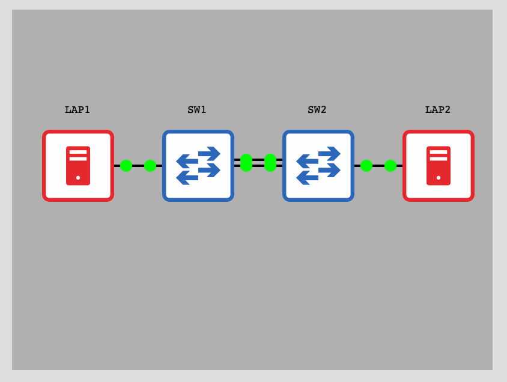

# Simple NX-OS lab

## Description



LAP1/LAP2 are 2 docker containers configured with IP addresses 192.168.1.1/24 and 192.168.1.2/24.

SW1/SW2 are 2 Nexus 9000v connected to each other using Eth1/1 and Eth1/2 with port-channel 10 configured and LACP.

Default VLAN 1 is used.

## Usage

Connect on the console port and copy/paste [configurations](./config/).

## Results

LAP1 and LAP2 can ping each other:

```
bash-5.1# ping 192.168.1.2
PING 192.168.1.2 (192.168.1.2) 56(84) bytes of data.
64 bytes from 192.168.1.2: icmp_seq=1 ttl=64 time=3.07 ms
64 bytes from 192.168.1.2: icmp_seq=2 ttl=64 time=3.42 ms
^C
--- 192.168.1.2 ping statistics ---
2 packets transmitted, 2 received, 0% packet loss, time 1001ms
rtt min/avg/max/mdev = 3.065/3.244/3.423/0.179 ms
```

Port-channel status on SW1:

```
SW1# sh int po10
port-channel10 is up
admin state is up,
  Hardware: Port-Channel, address: 0c4e.0000.0101 (bia 0c4e.0000.0101)
  MTU 1500 bytes, BW 2000000 Kbit , DLY 10 usec
  reliability 255/255, txload 1/255, rxload 1/255
  Encapsulation ARPA, medium is broadcast
  Port mode is access
  full-duplex, 1000 Mb/s
  Input flow-control is off, output flow-control is off
  Auto-mdix is turned off
  Switchport monitor is off
  EtherType is 0x8100
  Members in this channel: Eth1/1, Eth1/2
```

```
SW1# sh lacp port-channel interface port-channel 10
port-channel10
  Port Channel Mac=c-4e-0-0-1b-8
  Local System Identifier=0x8000,c-4e-0-0-1b-8
  Admin key=0x9
  Operational key=0x9
  Partner System Identifier=0x8000,c-99-0-0-1b-8
  Operational key=0x9
  Max delay=0
  Aggregate or individual=1
  Member Port List=Eth1/1 Eth1/2
```

Spanning-tree status on default VLAN 1:

```
SW1# sh spanning-tree vlan 1

VLAN0001
  Spanning tree enabled protocol rstp
  Root ID    Priority    32769
             Address     0c4e.0000.1b08
             This bridge is the root
             Hello Time  2  sec  Max Age 20 sec  Forward Delay 15 sec

  Bridge ID  Priority    32769  (priority 32768 sys-id-ext 1)
             Address     0c4e.0000.1b08
             Hello Time  2  sec  Max Age 20 sec  Forward Delay 15 sec

Interface        Role Sts Cost      Prio.Nbr Type
---------------- ---- --- --------- -------- --------------------------------
Po10             Desg FWD 3         128.4105 P2p
Eth1/3           Desg FWD 4         128.3    P2p
Eth1/4           Desg FWD 4         128.4    P2p
Eth1/5           Desg FWD 4         128.5    P2p
Eth1/6           Desg FWD 4         128.6    P2p
Eth1/7           Desg FWD 4         128.7    P2p
Eth1/8           Desg FWD 4         128.8    P2p
Eth1/9           Desg FWD 4         128.9    P2p
```

iperf3 tests show a bandwidth of around 2 Mbps:

On LAP2:
```
bash-5.1# iperf3 -s
-----------------------------------------------------------
Server listening on 5201
-----------------------------------------------------------
```

On LAP1:
```
bash-5.1# iperf3 -c 192.168.1.2
Connecting to host 192.168.1.2, port 5201
[  5] local 192.168.1.1 port 52046 connected to 192.168.1.2 port 5201
[ ID] Interval           Transfer     Bitrate         Retr  Cwnd
[  5]   0.00-1.00   sec   107 KBytes   879 Kbits/sec   15   2.83 KBytes
[  5]   1.00-2.00   sec  45.2 KBytes   371 Kbits/sec   31   2.83 KBytes
[  5]   2.00-3.00   sec   239 KBytes  1.96 Mbits/sec   62   2.83 KBytes
[  5]   3.00-4.00   sec   238 KBytes  1.95 Mbits/sec   70   2.83 KBytes
[  5]   4.00-5.00   sec   238 KBytes  1.95 Mbits/sec   66   2.83 KBytes
[  5]   5.00-6.00   sec   238 KBytes  1.95 Mbits/sec   66   2.83 KBytes
[  5]   6.00-7.00   sec   238 KBytes  1.95 Mbits/sec   66   2.83 KBytes
[  5]   7.00-8.00   sec   238 KBytes  1.95 Mbits/sec   68   2.83 KBytes
[  5]   8.00-9.00   sec   277 KBytes  2.27 Mbits/sec   68   2.83 KBytes
[  5]   9.00-10.00  sec   238 KBytes  1.95 Mbits/sec   70   2.83 KBytes
- - - - - - - - - - - - - - - - - - - - - - - - -
[ ID] Interval           Transfer     Bitrate         Retr
[  5]   0.00-10.00  sec  2.05 MBytes  1.72 Mbits/sec  582             sender
[  5]   0.00-10.00  sec  1.97 MBytes  1.65 Mbits/sec                  receiver

iperf Done.
```